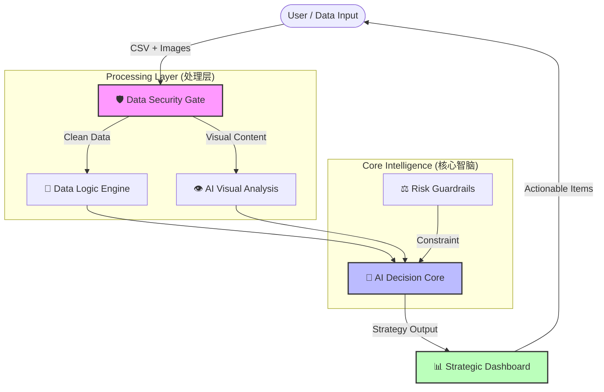

### Hi there, I'm Ray Chen 👋

> **AI Solution Architect | E-commerce Domain Expert**
> **AI 解决方案架构师 | 电商领域专家**
> *Bridging the gap between messy business data and actionable AI insights.*
> *致力于弥合“杂乱业务数据”与“可落地 AI 洞察”之间的鸿沟。*

---

### 🏆 Featured Project: EcomAI V6.5 (Enterprise Edition)
**企业级电商智能决策中台 | Intelligent Decision Engine**

> **Note**: This is a proprietary commercial project. The source code is private.
> **注**：本项目为私有商业架构，源码未公开。以下为系统核心逻辑与架构概览。

#### 🏗️ System Architecture (系统架构图)

#### 💡 Core Capabilities (核心能力)

*   **🛡️ Immune-Level Data Cleaning (免疫级数据清洗)**:
    *   **Shadow Mapping Algorithm**: Automatically maps inconsistent headers (e.g., "Campaign" -> "SKU") to ensure 100% data ingestion success.
    *   **影子映射算法**：自适应识别非标表头，解决多源数据格式不统一难题。

*   **👁️ Multimodal Visual Attribution (多模态视觉归因)**:
    *   Integrates **Google Gemini 2.0** to audit product image quality.
    *   **Value Mismatch Detection**: Identifies potential conflicts where a product's price is premium ($50+) but visual perception is low-end ($5).
    *   **价值错配检测**：交叉验证“视觉质感”与“定价策略”，挖掘数据背后的视觉动因。

*   **⚖️ Constitutional AI Governance (宪法级风控体系)**:
    *   Implements a **"Financial Circuit Breaker"** using deterministic Python logic.
    *   **财务熔断器**：通过硬编码规则（如利润红线），强制拦截 AI 可能产生的亏损性建议，确保决策安全。
    
### 🛠️ Tech Stack

---

### 📫 Contact
*   **Role**: Open to opportunities in **AI Architecture / Innovation Lead**.
*   **Demo**: Available upon request for live demonstration (Private Deployment).
*   **演示**: 支持预约现场演示 / 闭门路演。
