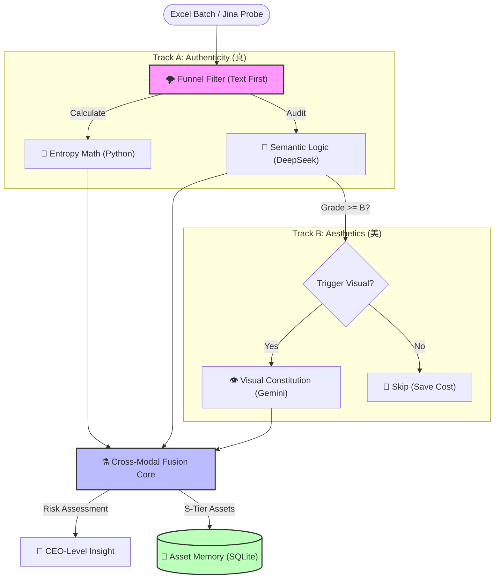

Hi there, I'm Ray Chen 👋

AI Solution Architect | E-commerce Domain Expert
AI 解决方案架构师 | 电商领域专家
Bridging the gap between messy business data and actionable AI insights.
致力于弥合“杂乱业务数据”与“可落地 AI 洞察”之间的鸿沟。

🏆 Featured Project 1: EcomAI V6.5 (Enterprise Edition)
企业级电商智能决策中台 | Intelligent Decision Engine
Note: This is a proprietary commercial project. The source code is private.
注：本项目为私有商业架构，源码未公开。以下为系统核心逻辑与架构概览。

  
  
👆 <strong>Click to Watch 90s Real-world Demo | 点击观看 90秒 实机演示</strong>

 

🏗️ System Architecture (系统架构图)

💡 Core Capabilities (核心能力)
🛡️ Immune-Level Data Cleaning (免疫级数据清洗):
Shadow Mapping Algorithm: Automatically maps inconsistent headers (e.g., "Campaign" -> "SKU") to ensure 100% data ingestion success.
影子映射算法：自适应识别非标表头，解决多源数据格式不统一难题。

👁️ Multimodal Visual Attribution (多模态视觉归因):
Integrates Google Gemini 2.0 to audit product image quality.
Value Mismatch Detection: Identifies potential conflicts where a product's price is premium (50+)butvisualperceptionislow−end(5).
价值错配检测：交叉验证“视觉质感”与“定价策略”，挖掘数据背后的视觉动因。

⚖️ Constitutional AI Governance (宪法级风控体系):
Implements a "Financial Circuit Breaker" using deterministic Python logic.
财务熔断器：通过硬编码规则（如利润红线），强制拦截 AI 可能产生的亏损性建议，确保决策安全。

🚀 Featured Project 2: KOL Audit Pro (Asset Refinery)
多模态达人资产合规审计系统 | Multimodal Influencer Compliance System
Vision: Transforming influencer selection from "Subjective Guesswork" to "Objective Audit".
愿景：将达人筛选从“主观盲猜”转化为“客观审计”，实现资产的长期沉淀。

<!-- 👇 KOL Video Insert Section Start -->

  
  
👆 <strong>Click to Watch 60s AI Audit Demo | 点击观看 60秒 多模态审计演示</strong>

<!-- 👆 KOL Video Insert Section End -->

 

🏗️ System Architecture (系统架构图)

💡 Core Capabilities (核心能力)
🌪️ Cost-Efficient Funnel Architecture (漏斗式算力架构):
Prioritizes high-speed text auditing to filter out low-quality inputs, triggering expensive Visual APIs only for qualified candidates. Reduces API costs by 80%.
漏斗筛选：优先运行文本/熵值审计，仅对合格样本触发视觉API，在保障精度的同时降低 80% 算力成本。

👁️ Visual Constitution & Rubric (宪法级视觉审计):
Injects strict scoring rubrics and locks model temperature (0.4) to solve GenAI hallucination and scoring inconsistency.
视觉宪法：通过提示词工程植入严格评分量表，并锁定随机性参数，彻底解决大模型审美的“幻觉”与评分抖动问题。

⚗️ Cross-Modal Risk Fusion (跨模态风险融合):
Synthesizes "Hard Metrics" (Entropy) and "Soft Vibe" (Visuals) to detect subtle mismatches (e.g., "Good Text" but "Cheap Visuals").
融合裁决：DeepSeek 综合文本硬指标与视觉软实力，精准识别“文案完美但图片廉价”的隐性风险，自动修正最终评级。

🛠️ Tech Stack

 📫 Contact
*   **Role**: Open to opportunities in **AI Architecture / Innovation Lead**.
*   **Demo**: Available upon request for live demonstration (Private Deployment).
*   **Email**: [点击发送邮件 / Click to Mail](mailto:raychen74771@gmail.com)
